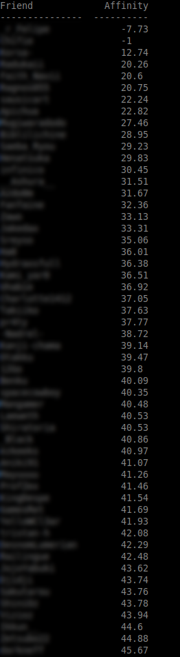

# MAL-affinity

MyAnimeList Affinity fetcher with a tabulated output of all your friends affinity

### Credits 

Credits to https://github.com/erkghlerngm44/aniffinity and https://github.com/AWConant/jikanpy.
Also special thanks for https://github.com/purplepinapples/mal-affinity

### How to use it 

This script works with Python3.6+. Tested on Linux and Mac.

Before running the script, install these packages :

 - `pip3 install tabulate`
 - `pip3 install objectpath`
 - `pip3 install git+https://github.com/AWConant/jikanpy` 
 - `pip3 install git+https://github.com/erkghlerngm44/aniffinity`

Give your MyAnimeList username on command line:

E.g.: `python3 anifinity.py Guts__`

P.S : This script takes time to get calculate your users affinity, so the more you have friends on MyAnimeList the more you'll have to wait until the script gives you the affinity values.

## Screenshot 

### Thanks 
